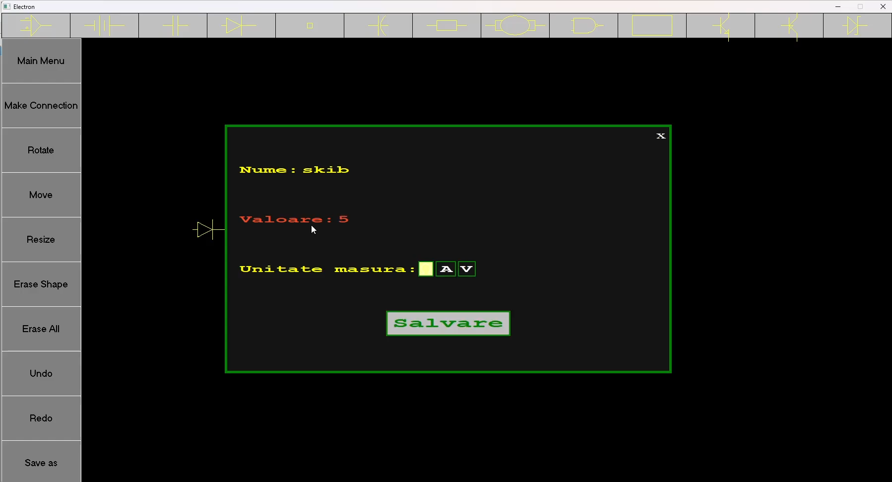
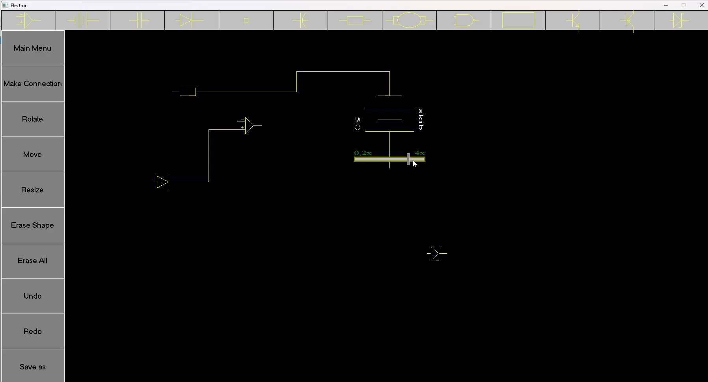
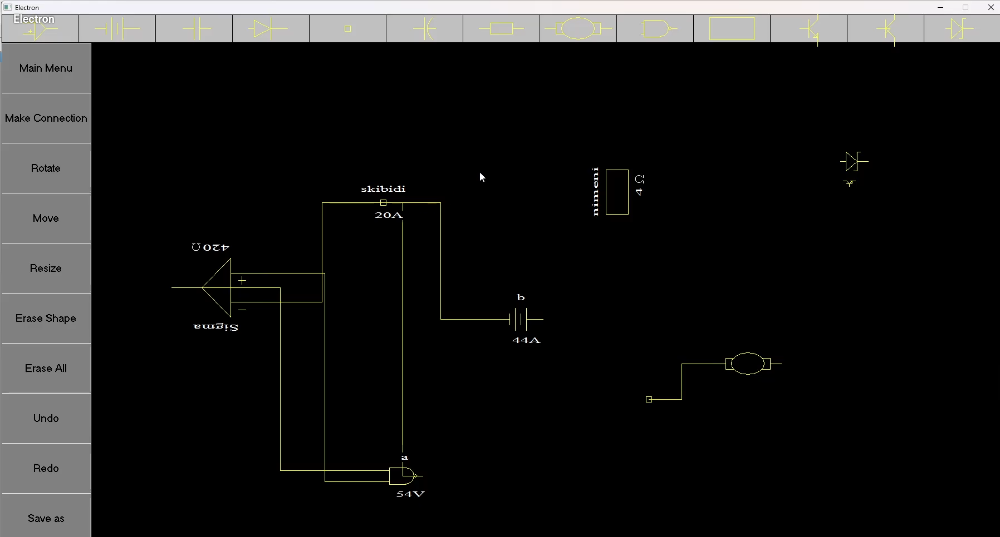

# Electron - Electronic Circuit Editor

**Electron** is an interactive application for designing, visualizing, and editing electronic circuits, developed in C++ as a university project at the Faculty of Computer Science (FII) for the course Introduction to Programming. The application is built using the classic **graphics.h** library, which meant that almost every UI element had to be drawn manually and all interactions meticulously implemented from the ground up.  

## Key Features
- **Workspace Interaction:** Place, move, rotate, delete, and dynamically resize electronic components.
- **Dynamic Routing:** Draw connections between components. New wires dynamically replace or update existing connections.
- **Property Editing:** Right-click context menus allow customizing each component's attributes (Name, Value, Units like Ω, A, V).
- **State Management:** Fully functional **Undo / Redo** system.
- **File Persistence:** Save the current workspace state or import existing projects from the local machine.  

## Technology & Implementation
Built with **graphics.h**, this project required building almost everything from scratch:
- All graphical components (sliders, buttons, menus) were drawn manually.
- Mouse and keyboard interactions were implemented at the pixel level.
- Dynamic updates and visual changes in the circuits were handled without any modern GUI framework, requiring careful attention to every visual element.  

## Screenshots

  
*Editing component name, value and unit.*

  
*Rotated component being resized using the slider.*

  
*More complex circuit with rotated, resized and named components.*

## Presentation Video
[Watch on YouTube](https://youtu.be/PaTXlvoh2m0)

## Authors
- Cosmin Ciobanu  
- Bogdan Chiriac  
